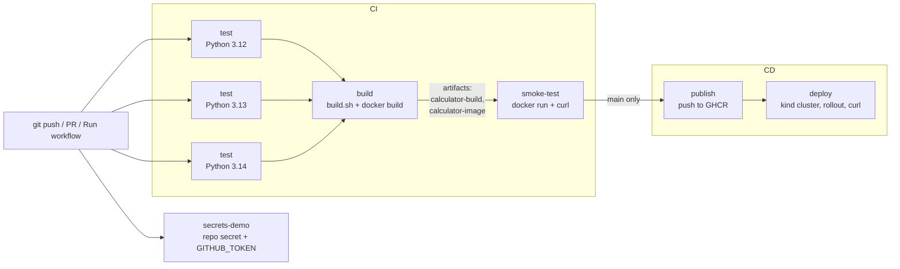

# Session 16: CI/CD with GitHub Actions - Homework

**Name:** Rudhar Bajaj
**Environment:** macOS (Apple Silicon), Docker Desktop (Engine 29.6.1), Python 3.12.13 / 3.13.14 / 3.14.6 (uv virtualenvs), kind v0.33.0 (Kubernetes v1.37 node), Trivy 0.75.0, Gitleaks 8.30.1, Bandit 1.9.4, pip-audit 2.10.1, actionlint 1.7.12

Every output block below is real output from commands I ran on 2026-10-07. Full untrimmed transcripts
are in `outputs/`. Where I shortened a listing I say so.

The task: build a complete CI/CD demo project with GitHub Actions, based on the instructor's
`10-final-cicd-pipeline` example, covering CI vs CD, the pipeline, workflows, jobs, steps, runners,
secrets, artifacts, build, test and pipeline execution. The deliverables are the app, a Dockerfile,
the workflow (CI + CD), proof that it runs, and this README.

## What is where

| Path | What it is |
|---|---|
| `app/calculator.py` | The instructor's calculator from `10-final-cicd-pipeline`, unchanged |
| `app/web.py` | My small Flask API around it (`/health`, `/`, `/api/<add\|subtract\|multiply\|divide>?a=&b=`) so it can run in a container and be curl-ed after a deploy |
| `tests/` | The instructor's 5 calculator tests + 10 API tests |
| `requirements.txt`, `requirements-dev.txt` | Pinned runtime deps / test deps |
| `pytest.ini`, `.coveragerc` | Test and coverage config |
| `build.sh` | Build step (based on the instructor's `build.sh`): makes `build/` with the app and `build-info.txt` |
| `Dockerfile`, `.dockerignore` | Slim, digest-pinned, non-root image served by gunicorn |
| `k8s/deployment.yaml`, `k8s/service.yaml` | What the CD job deploys (2 replicas, probes, resource limits) |
| **`../../.github/workflows/session16-cicd.yml`** | **The pipeline.** It sits at the repo root because GitHub only runs workflows from the root `.github/workflows/`. The `.github` folders inside the instructor's lesson folders never run. |

## Local outputs (my "screenshots")

I ran every stage of the pipeline on my Mac before pushing, so I knew each one works before
GitHub ran it. These text transcripts replace screenshots. Each command is shown as a `$ command`
line followed by its output and exit code. The scratch directory outside the repo appears as `$T`, and I
shortened its long temp path to `<scratch>` in the transcripts.

| File | What it shows |
|---|---|
| [`outputs/00-first-run-coverage-gate-failed.txt`](outputs/00-first-run-coverage-gate-failed.txt) | My first test run: 15 tests passed but the 80 % coverage gate **failed** (60 %) |
| [`outputs/01-test-matrix.txt`](outputs/01-test-matrix.txt) | The `test` job for Python 3.12, 3.13 and 3.14 (the matrix): 15 passed, 100 % coverage |
| [`outputs/02-build-and-artifact.txt`](outputs/02-build-and-artifact.txt) | `build.sh`, `docker build`, and the save/load hand-off of the image tarball |
| [`outputs/03-smoke-test-container.txt`](outputs/03-smoke-test-container.txt) | The `smoke-test` job: run the container, curl it, check `10 + 5 = 15` |
| [`outputs/04-first-security-scan-trivy-failed.txt`](outputs/04-first-security-scan-trivy-failed.txt) | My first Trivy scan: **failed** with 4 HIGH in pip's vendored libraries |
| [`outputs/05-security-scans.txt`](outputs/05-security-scans.txt) | Bandit, pip-audit, Gitleaks and Trivy after the fix: all clean |
| [`outputs/06-deploy-kind.txt`](outputs/06-deploy-kind.txt) | The `deploy` job on a throwaway kind cluster: apply, rollout status, curl |
| [`outputs/07-actionlint.txt`](outputs/07-actionlint.txt) | `actionlint` on both root workflows: no findings |

## Pipeline diagram



## Concept → where it is in the workflow

Line numbers refer to `.github/workflows/session16-cicd.yml`.

| Concept | Where | What I did |
|---|---|---|
| **Workflow** | whole file, `name:` line 7 | One YAML file under the root `.github/workflows/`. It says **when** (triggers) and **what** (jobs and steps). |
| **Triggers / pipeline execution** | `on:` lines 9-20 | `push` and `pull_request` to `main`, but only when `session-16-github-actions/homework/**` or this workflow file changes (`paths:`), plus `workflow_dispatch` for a manual "Run workflow" button. |
| **Jobs** | `jobs:` line 40 | 6 jobs: `test`, `secrets-demo`, `build`, `smoke-test`, `publish`, `deploy`. Each job gets a fresh VM. |
| **Steps** | every `steps:` list | Steps in a job run in order on the same runner. Some are `uses:` (a ready-made action such as `actions/checkout@v7`), some are `run:` (shell). |
| **Job order (`needs`)** | lines 145, 189, 237, 289 | `build` needs `test`, `smoke-test` needs `build`, and so on. If `test` fails, nothing after it runs. `secrets-demo` has no `needs`, so it runs in parallel with `test`. |
| **Runners** | `runs-on: ubuntu-latest` (e.g. line 44) | GitHub-hosted Ubuntu VMs. The first step of `test` prints `RUNNER_OS`, `RUNNER_ARCH` and `RUNNER_NAME` (lines 62-67). |
| **Matrix** | lines 45-48 | `python-version: ["3.12", "3.13", "3.14"]` turns one job definition into 3 parallel jobs. `fail-fast: false` so one failing version doesn't cancel the others. |
| **CI: test** | lines 69-82 | Install pinned deps, run pytest with JUnit XML + coverage XML/HTML, and fail under 80 % coverage. |
| **CI: build** | lines 158-176 | `./build.sh` makes `build/` with `build-info.txt` (commit SHA, run number), then `docker build` tags the image with the commit SHA. |
| **Artifacts (reports)** | lines 84-90 | `s16-test-report-py3.x` with `junit.xml`, `coverage.xml` and `htmlcov/`. Uploaded with `if: always()`, so I can still download the report when tests fail. |
| **Artifacts (passing between jobs)** | upload lines 161-184, download lines 198-208 and 256-260 | `build` uploads `calculator-build` (the `build/` folder) and `calculator-image` (the `docker save` tarball). `smoke-test` and `publish` download them. `publish` pushes the exact image that was smoke-tested, not a rebuild. |
| **Secrets: repository secret** | lines 100-131 | `DEMO_API_KEY` is mapped to a job-level env var. Steps check `if: env.DEMO_API_KEY != ''`, because the `secrets` context isn't allowed in a step `if:`. If the secret doesn't exist, the "not configured" branch runs and the job still passes. |
| **Secrets: masking** | lines 121-127 | GitHub replaces a registered secret with `***` in the log. A value *derived* from a secret is not masked automatically, so I register it with `::add-mask::`. |
| **Secrets: `GITHUB_TOKEN`** | lines 133-140, 262-267, 308-313 | Automatic per-run token. Used read-only for the API (`gh api`) and to log in to GHCR. Its permissions come from `permissions:`: `contents: read` by default (line 23), `packages: write` only in `publish` (line 243). |
| **CD: delivery (registry)** | `publish`, lines 235-284 | Only on `main` and never on PRs (`if:` line 239). Loads the tested image, tags `:<sha>` and `:latest`, and pushes to `ghcr.io/rudhar07/devops-heros/session16-calculator`. |
| **CD: deployment** | `deploy`, lines 287-353 | `helm/kind-action` makes a real single-node Kubernetes cluster inside the runner. The job pulls the image from GHCR, loads it into kind, puts the SHA into the manifest with `sed`, then runs `kubectl apply`, `rollout status`, port-forward and curl. It checks that `GET /` reports the same commit SHA as the run. |
| **Least privilege / hygiene** | lines 23-28, `persist-credentials: false` | Read-only token by default. `concurrency` cancels an older run of the same branch. Checkout doesn't leave the token in `.git/config`. |

## CI vs CD (with this project as the example)

| | CI (continuous integration) | CD (continuous delivery / deployment) |
|---|---|---|
| Question it answers | "Is this commit OK?" | "Can this commit be released, and is it running?" |
| In my workflow | `test` (matrix), `build`, `smoke-test` | `publish` (delivery: a versioned image in a registry) and `deploy` (deployment to Kubernetes) |
| Runs on | every push and every PR | push to `main` only |
| Output | test reports, build artifact, image tarball | `ghcr.io/...:<sha>` image, a rolled-out Deployment |

Continuous **delivery** means every green commit on `main` produces a releasable artifact (my GHCR
image). Continuous **deployment** goes one step further and deploys it automatically (my `deploy`
job). The real target here is a kind cluster that only lives inside the runner. That is
the honest part: it is a real Kubernetes API, real pods and a real rollout, but it is thrown away at the end
of the job. Deploying to a long-lived cluster would only change the "create cluster" step into
"load a kubeconfig from a secret" (as in the instructor's session-17 `03-kubernetes-deployment`).

## Task: CI - test (matrix), build, artifacts

What I did: I kept the instructor's calculator and its 5 tests, added a tiny Flask API with 10 more
tests, and ran the exact `pytest` command of the workflow in 3 virtualenvs (3.12, 3.13, 3.14).

My first run failed the coverage gate ([`outputs/00-first-run-coverage-gate-failed.txt`](outputs/00-first-run-coverage-gate-failed.txt)):

```text
TOTAL                  70     28    60%
FAIL Required test coverage of 80% not reached. Total coverage: 60.00%
============================== 15 passed in 0.34s ==============================
```

All tests passed, but the instructor's `calculator.py` has an interactive `input()` loop under
`if __name__ == "__main__":` that unit tests can't drive. I excluded that block in `.coveragerc`
(`exclude_also`) rather than lowering the threshold. After that, on all three versions
([`outputs/01-test-matrix.txt`](outputs/01-test-matrix.txt)):

```text
Python 3.12.13 ... Required test coverage of 80% reached. Total coverage: 100.00%
============================== 15 passed in 0.28s ==============================
Python 3.13.14 ... Required test coverage of 80% reached. Total coverage: 100.00%
============================== 15 passed in 0.23s ==============================
Python 3.14.6  ... Required test coverage of 80% reached. Total coverage: 100.00%
============================== 15 passed in 0.22s ==============================
```

(trimmed: one line per Python version from the full transcript)

The build step and the artifact hand-off ([`outputs/02-build-and-artifact.txt`](outputs/02-build-and-artifact.txt)):

```text
$ GITHUB_SHA=local-test GITHUB_WORKFLOW='local run' GITHUB_RUN_NUMBER=0 ./build.sh
Build files:
build/app/__init__.py
build/app/calculator.py
build/app/web.py
build/build-info.txt
build/requirements.txt

Application: Session 16 Calculator
Version: 1.0.0
Git commit: local-test
...
$ docker image inspect -f 'User={{.Config.User}} Arch={{.Architecture}} Cmd={{.Config.Cmd}}' session16-calculator:local-test
User=10001 Arch=arm64 Cmd=[gunicorn --bind 0.0.0.0:8000 --workers 2 --no-control-socket --access-logfile - app.web:app]
$ docker rmi session16-calculator:local-test
$ docker load -i $T/image.tar.gz
Loaded image: session16-calculator:local-test
```

**What I observed:** the coverage gate did its job on the first try. It failed even though every
test was green, which is the point of a gate. `docker save` → `docker load` is exactly what happens
between the `build` and `smoke-test` jobs, because each job runs on a different VM and the only
way to pass files between them is an artifact.

## Task: CI - smoke-test the built image

([`outputs/03-smoke-test-container.txt`](outputs/03-smoke-test-container.txt), host port 8083)

```text
$ curl -fsS http://localhost:8083/; echo
{"app":"session16-calculator","commit":"local-test","operations":["add","divide","multiply","subtract"],"version":"1.0.0"}
$ curl -fsS 'http://localhost:8083/api/add?a=10&b=5' | tee /tmp/hw-d-add.json; echo
{"a":10.0,"b":5.0,"operation":"add","result":15.0}
$ jq -e '.result == 15' /tmp/hw-d-add.json
true
$ curl -sS -w ' -> HTTP %{http_code}' 'http://localhost:8083/api/divide?a=1&b=0'; echo
{"error":"Cannot divide by zero"}
 -> HTTP 400
Container runs as: uid=10001(appuser) gid=10001(appuser) groups=10001(appuser)
```

**What I observed:** in my first container run gunicorn 26 logged
`Control server error: [Errno 13] Permission denied: '/home/appuser'`. The new gunicorn control
socket wants a home directory, and my non-root user has none. The app still served traffic, but I
added `--no-control-socket` (I don't use `gunicornc`), and the re-run log is clean. I check the
result with `jq -e '.result == 15'` rather than a string compare, because `15.0` vs `15` depends on
the jq version on the runner.

## Task: Security checks on the image (extra)

The session-16 workflow doesn't contain the security stages (that is session 17), but I ran the same
tools here so I would know this image is clean.

My first Trivy scan **failed** ([`outputs/04-first-security-scan-trivy-failed.txt`](outputs/04-first-security-scan-trivy-failed.txt)):

```text
Python (python-pkg)
===================
Total: 4 (HIGH: 4, CRITICAL: 0)
│ msgpack    │ GHSA-6v7p-g79w-8964 │ HIGH │ fixed │ 1.1.2  │ 1.2.1  │
│ setuptools │ CVE-2025-47273      │      │       │ 70.3.0 │ 78.1.1 │
│ urllib3    │ CVE-2026-97687      │      │       │ 2.7.0  │ 2.8.0  │
│            │ CVE-2026-97689      │      │       │        │        │
```

(trimmed: title column removed)

None of these is my dependency. They come from a CycloneDX SBOM that pip ships for its own vendored
libraries (`/usr/local/lib/python3.13/site-packages/pip/_vendor/bom.cdx.json`). The app never uses pip
at runtime, so the Dockerfile now runs `pip uninstall -y pip` right after installing the
requirements. After that ([`outputs/05-security-scans.txt`](outputs/05-security-scans.txt)):

```text
$ bandit -r app
	No issues identified.
$ pip-audit -r requirements-dev.txt --strict --desc
No known vulnerabilities found
$ gitleaks dir . --redact --no-banner -v
10:05PM INF no leaks found
$ trivy image --no-progress --scanners vuln --severity HIGH,CRITICAL --ignore-unfixed --exit-code 1 session16-calculator:local-test
│ session16-calculator:local-test (debian 13.7)   │   debian   │        0        │
...
[exit code: 0]
```

## Task: CD - publish to GHCR and deploy to Kubernetes

The `publish` job can only run on GitHub (it needs `GITHUB_TOKEN`). Locally I ran everything else in
the `deploy` job on a throwaway kind cluster called `hw-d`, using the same `sed` / `apply` /
`rollout status` / curl commands. The image came from my local build instead of `docker pull ghcr.io/...`
([`outputs/06-deploy-kind.txt`](outputs/06-deploy-kind.txt), port-forward on 18083):

```text
$ kubectl apply -f $T/k8s16/
          image: ghcr.io/rudhar07/devops-heros/session16-calculator:local-test
deployment.apps/calculator created
service/calculator created
$ kubectl rollout status deployment/calculator --timeout=120s
deployment "calculator" successfully rolled out
$ kubectl get deploy,pods,svc -l app=calculator -o wide
deployment.apps/calculator   2/2     2            2           ...
pod/calculator-94dd7b5d9-8p4dz   1/1     Running   0          ...
pod/calculator-94dd7b5d9-bk24t   1/1     Running   0          ...
$ ... curl -fsS http://localhost:18083/ ...
{"app":"session16-calculator","commit":"local-test",...}
true
{"a":6.0,"b":7.0,"operation":"multiply","result":42.0}
```

(trimmed: columns cut, see the transcript for the full lines)

**What I observed:** the check `.commit == <sha>` is what makes this a real CD test and not just
"a pod is running". The pod has to report the exact commit the pipeline built. My first local
attempt (transcript not kept, I re-ran it) hit `ImagePullBackOff` because of a typo in my own shell command. In zsh, `$IMAGE:l`
means "lowercase", so `kind load` got a wrong image name. Using `${IMAGE}` fixed it. The workflow
runs in bash, so it isn't affected.

## Secrets: how to add `DEMO_API_KEY` (optional)

The pipeline passes without it. To see the masking demo:

1. GitHub → the repo → **Settings → Secrets and variables → Actions → New repository secret**
2. Name `DEMO_API_KEY`, value e.g. `demo-key-123-not-real` (a **fake** value; never put a real credential in a demo)
3. **Actions → Session 16 - CI/CD Pipeline → Run workflow**

The `secrets-demo` job then shows `Secret value as GitHub prints it: ***` and
`Derived value after add-mask: ***`. Without the secret it shows a notice and continues.
`GITHUB_TOKEN` needs no setup. GitHub creates it for every run and it expires when the job ends.

## Validation of the workflow file

[`outputs/07-actionlint.txt`](outputs/07-actionlint.txt): `actionlint` (which also runs shellcheck on
every `run:` block) reports nothing for both root workflows. Earlier it caught two unused loop
variables (`for i in ...`), which I renamed to `_`.

## Pipeline run on GitHub

**Successful run:** https://github.com/rudhar07/devops-heros/actions/runs/37696351828
(`workflow_dispatch` on `main`, 2026-10-07 22:27 UTC). Result: **success**, all 8 jobs green.

| Job | Result |
|---|---|
| Test (Python 3.12) | success |
| Test (Python 3.13) | success |
| Test (Python 3.14) | success |
| Secrets demo (repo secret + GITHUB_TOKEN) | success |
| Build app + Docker image | success |
| Smoke-test the image | success |
| Push image to GHCR | success |
| Deploy to Kubernetes (kind) | success |

The image is published as `ghcr.io/rudhar07/devops-heros/session16-calculator`. Open the run to see the
uploaded test-report and build artifacts.

The very first run (triggered by the push, run `37695840404`) failed at `actions/checkout` before any
of my steps ran. The instructor's repo, which I merged, contained a submodule entry
(`session-16-github-actions/mini-project 10-33-34-265`) with no URL in `.gitmodules`, and checkout
aborts on it. I removed that broken entry and re-ran the workflow, which is the green run above. The
local outputs in this README show each stage working before the push.

## Honest notes / differences from the spec

- **Screenshots** are replaced by the text transcripts in `outputs/` (same as earlier sessions). The
  GitHub run link goes in the section above.
- **Deploy target** is an ephemeral kind cluster inside the runner, not a long-lived cluster. It is a
  real Kubernetes rollout and needs no cloud credentials, but nothing keeps running after the job.
- **GHCR package visibility:** the first push creates the package
  `ghcr.io/rudhar07/devops-heros/session16-calculator`. GitHub may create it as private. The pipeline
  doesn't care, because `deploy` logs in with `GITHUB_TOKEN`. To let anyone `docker pull` it: the
  package page → **Package settings → Change visibility → Public**.
- Locally I ran Python 3.12/3.13/3.14 on macOS arm64. On GitHub the same matrix runs on Ubuntu x86_64.
