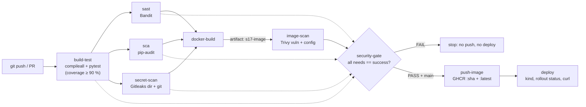

# Session 17: CI/CD + DevSecOps - Homework

**Name:** Rudhar Bajaj
**Environment:** macOS (Apple Silicon), Docker Desktop (Engine 29.6.1), Python 3.13.14 (uv virtualenv), Bandit 1.9.4, pip-audit 2.10.1, Gitleaks 8.30.1, Trivy 0.75.0, kind v0.33.0 (Kubernetes v1.37 node), kubectl v1.36.1, actionlint 1.7.12

Every output block below is real output from commands I ran on 2026-10-07. Full untrimmed transcripts
are in `outputs/`. Where I shortened a listing I say so.

The task: a complete CI/CD + DevSecOps pipeline with this flow:

**Code → Build → Unit Test → SAST → SCA → Secret Scan → Docker Build → Container Image Scan → Security Gate → Push Image → Deploy to Kubernetes**

Deliverables: application, Dockerfile, GitHub Actions workflow, security tool configuration,
Kubernetes manifests, successful pipeline output, README.

## What is where

| Path | What it is |
|---|---|
| `app/app.py`, `app/templates/`, `app/static/` | The instructor's DevSecOps Dashboard from `../demo/`, hardened (see "SAST" below). The UI files are copied unchanged. |
| `tests/test_app.py` | The instructor's 8 tests + 18 more for the hardening changes (26 total) |
| `requirements.txt` / `requirements-dev.txt` / `requirements-security.txt` | Runtime / test / scanner dependencies, all pinned |
| `pytest.ini` | Test config |
| `pyproject.toml` | **Bandit config** (`[tool.bandit]`) + coverage config |
| `.gitleaks.toml` | **Gitleaks config**: all default rules, skips only the generated `reports/` folder (why: see "Secret scanning") |
| `Dockerfile`, `.dockerignore` | `python:3.13-slim-trixie` **pinned by digest**, non-root UID 10001, no pip in the final image, gunicorn, HEALTHCHECK |
| `k8s/deployment.yaml`, `k8s/service.yaml` | Deployment (2 replicas, readiness + liveness probes, requests/limits, non-root, read-only root fs, all capabilities dropped, seccomp, no SA token) + ClusterIP Service |
| **`../../.github/workflows/session17-devsecops.yml`** | **The pipeline.** It is at the repo root because GitHub only runs workflows from the root `.github/workflows/`. The instructor's `demo/.github/workflows/devsecops.yml` never runs from where it is. |

There is **no `.trivyignore`**: the image passes the gate without ignoring anything.

## Local outputs (my "screenshots")

I ran every stage locally before pushing. The outputs prove each stage works before GitHub runs
it, including that each gate **fails** when it should. `$T` / `$V` are scratch folders outside the repo. I shortened their long temp path to `<scratch>` in the transcripts.

| File | What it shows |
|---|---|
| [`outputs/00-first-image-scan-failed.txt`](outputs/00-first-image-scan-failed.txt) | My first image: Trivy gate **FAILED** (4 HIGH in pip's vendored libs), and how I found the cause |
| [`outputs/01-build-and-unit-tests.txt`](outputs/01-build-and-unit-tests.txt) | Build (`compileall`) + 26 unit tests, 97.95 % coverage (gate: 90 %) |
| [`outputs/02-sast-bandit.txt`](outputs/02-sast-bandit.txt) | Bandit JSON/SARIF reports + gate: no issues |
| [`outputs/03-sca-pip-audit.txt`](outputs/03-sca-pip-audit.txt) | pip-audit JSON report + gate: no known vulnerabilities in 14 packages |
| [`outputs/04-secret-scan-gitleaks.txt`](outputs/04-secret-scan-gitleaks.txt) | Gitleaks on the folder and on git history, and the false positive that led to `.gitleaks.toml` |
| [`outputs/05-docker-build.txt`](outputs/05-docker-build.txt) | Image build: user 10001, healthcheck, pip removed |
| [`outputs/06-image-scan-trivy.txt`](outputs/06-image-scan-trivy.txt) | Trivy reports, vulnerability gate and misconfiguration gate: both pass |
| [`outputs/07-docker-run.txt`](outputs/07-docker-run.txt) | Container run with read-only root fs and no capabilities: curl, headers, healthcheck |
| [`outputs/08a-deploy-kind-first-try-probe-timeouts.txt`](outputs/08a-deploy-kind-first-try-probe-timeouts.txt) | First kind deploy: rollout **timed out** (probe timeouts on a busy machine) |
| [`outputs/08-deploy-kind.txt`](outputs/08-deploy-kind.txt) | kind deploy after the fix: rollout OK, securityContext verified in the pod, curl OK |
| [`outputs/09-gates-fail-then-pass.txt`](outputs/09-gates-fail-then-pass.txt) | **Every gate failing on a deliberately bad input, then passing on my code**, plus the security-gate job logic |
| [`outputs/10-ci-install-steps-on-linux.txt`](outputs/10-ci-install-steps-on-linux.txt) | The workflow's Gitleaks/Trivy install steps run in `ubuntu:24.04` amd64: checksums OK |
| [`outputs/11-actionlint.txt`](outputs/11-actionlint.txt) | actionlint (+ shellcheck) on both root workflows: 0 errors |

## Pipeline diagram



SAST, SCA and secret scanning run **in parallel** after the tests. They are independent, so there
is no reason to wait for one before starting another. `docker-build` waits for all three. That
gives the same order as the spec (nothing is built before all code-level checks pass) but finishes faster.

## Concept → where it is in the workflow

Line numbers refer to `.github/workflows/session17-devsecops.yml`.

| Stage / concept | Where | Gate (what makes it fail) |
|---|---|---|
| Triggers | `on:` lines 8-19 | push/PR to `main` touching `session-17-devsecops/homework/**` or this file, plus `workflow_dispatch` |
| Least privilege | `permissions: contents: read` line 21. Only `push-image` gets `packages: write` (line 327) | n/a |
| Pinned scanner versions | `env:` lines 34-35. Downloads verified with `sha256sum -c` (lines 175, 260) | checksum mismatch fails the install step |
| **Build** | `build-test`, line 66 `python -m compileall -q app` | syntax error → fail |
| **Unit test** | `build-test`, lines 68-75 | any failed test, or coverage < 90 % |
| **SAST** (Bandit) | `sast`, reports lines 104-108, gate line 111 | any finding with severity ≥ MEDIUM and confidence ≥ MEDIUM |
| **SCA** (pip-audit) | `sca`, report line 143, gate line 146 | any known vulnerability in the pinned deps (`--strict`: also if a package can't be audited) |
| **Secret scanning** (Gitleaks) | `secret-scan`, `dir` scan line 183, `git` history scan line 189 (`fetch-depth: 0` line 165) | any leak in the homework files or in any commit that touched them |
| **Docker build** | `docker-build`, line 214. `needs: [sast, sca, secret-scan]` line 204 | build error. It doesn't start at all if a code-level check failed |
| **Container image scan** (Trivy) | `image-scan`: reports lines 268-270, vuln gate lines 274-277, misconfig gate line 280 | fixable HIGH/CRITICAL CVE in the image, or HIGH/CRITICAL misconfiguration in Dockerfile/k8s |
| **Security gate** | `security-gate`, lines 291-317. `if: !cancelled()` + `toJSON(needs)` | any of the 6 previous jobs not `success` (failure **or** skipped) → exit 1 + summary table |
| **Container registry** | `push-image`, lines 319-371: GHCR login with `GITHUB_TOKEN`, push `:sha` and `:latest` | only on `main`, never on PRs (line 323). Pushes the **scanned** artifact, not a rebuild |
| **Kubernetes deployment** | `deploy`, lines 373-436: kind cluster (line 389), pull from GHCR, `kind load`, apply, `rollout status` (line 416), curl | rollout timeout, or the running pod reports a different commit (line 428) |
| Artifacts / reports | every scan job uploads `reports/` with `if: always()` (lines 78, 114, 149, 194, 283) | n/a. Reports are kept even when the gate fails, which is when you need them |

## Stage: build + unit tests

([`outputs/01-build-and-unit-tests.txt`](outputs/01-build-and-unit-tests.txt))

```text
$ python -m compileall -q app && echo 'compileall OK'
compileall OK
...
TOTAL               124      2     22      1    98%
Required test coverage of 90% reached. Total coverage: 97.95%
============================== 26 passed in 0.26s ==============================
```

## Stage: SAST (Bandit)

Bandit is configured in `pyproject.toml` (`[tool.bandit]`). It scans `app/` with no skipped checks.
The gate is `--severity-level medium --confidence-level medium`, and the full report (all
severities) is uploaded as JSON and SARIF.

The instructor's demo app fails this gate. That was my "fail" case
([`outputs/09-gates-fail-then-pass.txt`](outputs/09-gates-fail-then-pass.txt), on a copy outside the repo):

```text
>> Issue: [B201:flask_debug_true] A Flask app appears to be run with debug=True, which exposes the Werkzeug debugger and allows the execution of arbitrary code.
   Severity: High   Confidence: Medium
   Location: app/app.py:234:4
>> Issue: [B104:hardcoded_bind_all_interfaces] Possible binding to all interfaces.
   Severity: Medium   Confidence: Medium
...
	Total issues (by severity):
		Low: 5
		Medium: 1
		High: 1
[exit code: 1]
```

What I changed in my copy, and why:

| Finding / problem | Fix in `app/app.py` |
|---|---|
| B201 `debug=True` (HIGH): the Werkzeug debugger allows remote code execution | removed. The container runs gunicorn, and `app.run()` is only for local dev |
| B104 bind to `0.0.0.0` (MEDIUM) | `app.run(host="127.0.0.1")`. In the container, gunicorn binds (Dockerfile `CMD`) |
| B311 `random` (LOW, 5×) | `secrets.SystemRandom()` |
| `power` with a huge exponent → `OverflowError` → HTTP 500 | caught, returns 400. Test `test_calculator_overflow_is_400_not_500` |
| `fail_chance: "abc"` → `ValueError` → 500 | validated (0 to 1), returns 400 |
| `datetime.utcnow()` is deprecated | `datetime.now(timezone.utc)` |
| no security headers | `X-Content-Type-Options: nosniff`, `X-Frame-Options: DENY`, `Referrer-Policy: no-referrer` |

Result on my code ([`outputs/02-sast-bandit.txt`](outputs/02-sast-bandit.txt)):

```text
{
  "loc": 203,
  "SEVERITY.HIGH": 0,
  "SEVERITY.MEDIUM": 0,
  "SEVERITY.LOW": 0
}
$ bandit -c pyproject.toml -r app --severity-level medium --confidence-level medium
Test results:
	No issues identified.
[exit code: 0]
```

I used Bandit instead of the instructor's CodeQL because it runs the same way on my laptop and
in CI, and its exit code is a gate by itself. CodeQL uploads findings to the Security tab, and you
need extra steps to make it block a pipeline.

## Stage: SCA (pip-audit)

([`outputs/03-sca-pip-audit.txt`](outputs/03-sca-pip-audit.txt))

```text
$ pip-audit -r requirements-dev.txt --strict --desc
No known vulnerabilities found
[exit code: 0]
```

Fail case: an old `Flask==2.2.0` / `Werkzeug==2.2.2` in a temp requirements file
([`outputs/09-gates-fail-then-pass.txt`](outputs/09-gates-fail-then-pass.txt)):

```text
Found 23 known vulnerabilities in 2 packages
Name     Version ID              Fix Versions
-------- ------- --------------- ------------
flask    2.2.0   PYSEC-2023-62   2.2.5,2.3.2
flask    2.2.0   PYSEC-2026-2151 3.1.3
werkzeug 2.2.2   PYSEC-2023-57   2.2.3
...
werkzeug 2.2.2   CVE-2026-102598 3.1.9
[exit code: 1]
```

(trimmed: 23 rows in the transcript)

Remediation is what the "Fix Versions" column says: bump the pin, run the tests, run SCA again.
`Flask==3.1.3` is exactly the version that fixes PYSEC-2026-2151, which is why it is pinned.

## Stage: Secret scanning (Gitleaks)

Two scans in the workflow:

1. `gitleaks dir .` on the homework folder: the files as they are in this commit.
2. `gitleaks git . --log-opts="--all -- session-17-devsecops/homework .github/workflows/session17-devsecops.yml"`:
   every commit that ever touched those paths. A secret that was committed and later deleted is
   still in history, and only this mode finds it.

I run the gitleaks binary (pinned, checksum-verified) instead of `gitleaks/gitleaks-action`. That
avoids the action's license-key question and runs the same command as on my laptop. The install
step was tested in an `ubuntu:24.04` amd64 container ([`outputs/10-ci-install-steps-on-linux.txt`](outputs/10-ci-install-steps-on-linux.txt)):

```text
--- install-gitleaks.sh
gitleaks_8.30.1_linux_x64.tar.gz: OK
8.30.1
--- install-trivy.sh
trivy_0.75.0_Linux-64bit.tar.gz: OK
Version: 0.75.0
x86_64
```

**Why `.gitleaks.toml` exists:** after my local Trivy run, gitleaks started failing on my own
folder. Trivy's JSON report (in the gitignored `reports/` folder) copies the image history, and
the Python base image sets `ENV GPG_KEY=...`, its public release-signing key fingerprint
([`outputs/04-secret-scan-gitleaks.txt`](outputs/04-secret-scan-gitleaks.txt)):

```text
$ cd reports && gitleaks dir trivy-image.json --redact --no-banner -v
Finding:     "created_by": "ENV GPG_KEY=REDACTED"
RuleID:      generic-api-key
File:        trivy-image.json
...
WRN leaks found: 2
[exit code: 1]
```

That is a false positive in a generated file that is never committed. The config keeps **all**
default rules and only skips `reports/`. On GitHub `reports/` doesn't even exist when the
secret-scan job runs, because it is a fresh checkout.

Fail case: a copy of the folder **with the same `.gitleaks.toml`** plus a file holding a
fake, randomly generated AWS key pair. The value was never printed and `--redact` hides it
([`outputs/09-gates-fail-then-pass.txt`](outputs/09-gates-fail-then-pass.txt)):

```text
Finding:     AWS_SECRET_ACCESS_KEY = "REDACTED"
RuleID:      generic-api-key
Line:        3
Finding:     ...WS_ACCESS_KEY_ID = "REDACTED
RuleID:      aws-access-token
Line:        2
WRN leaks found: 2
[exit code: 1]

# Same gate on my homework folder:
$ gitleaks dir . --redact --no-banner
INF no leaks found
[exit code: 0]
```

So my config didn't weaken detection. The fake file was in a temp folder outside the repo and was
deleted at the end of the transcript.

**If a real secret ever leaks** (06-secret-scanning practice question): deleting the line is not
enough. Revoke/rotate the credential first, then remove it from history if needed, check for misuse,
and store the replacement in a secret manager or GitHub Actions secret. A GitHub Actions secret is
injected at run time and masked in logs. A source-code secret is readable by anyone who can read the
repo, forever, through git history.

## Stage: Docker build

`Dockerfile`: digest-pinned slim base, deps first (layer cache), `pip uninstall -y pip` after
installing, `USER 10001`, gunicorn, HEALTHCHECK. The image is built once in `docker-build` and handed to
the next jobs as the `s17-image` artifact. So the image that gets scanned is the image that gets pushed.
([`outputs/05-docker-build.txt`](outputs/05-docker-build.txt))

```text
User=10001 Arch=arm64 Healthcheck=[CMD python -c import urllib.request; urllib.request.urlopen('http://127.0.0.1:8080/health', timeout=2)]
pip present in image: False
```

## Stage: Container image scan (Trivy) and why pip is removed

My **first** image failed the gate ([`outputs/00-first-image-scan-failed.txt`](outputs/00-first-image-scan-failed.txt)):

```text
msgpack 1.1.2 -> fixed in 1.2.1  GHSA-6v7p-g79w-8964
setuptools 70.3.0 -> fixed in 78.1.1  CVE-2025-47273
urllib3 2.7.0 -> fixed in 2.8.0  CVE-2026-97687
urllib3 2.7.0 -> fixed in 2.8.0  CVE-2026-97689
$ docker run --rm --entrypoint sh session17-devsecops:first-try -c 'find / -xdev -name "*.cdx.json" 2>/dev/null'
/usr/local/lib/python3.13/site-packages/pip/_vendor/bom.cdx.json
```

These are pip's vendored libraries (pip ships an SBOM of them), not my app's dependencies. The app
never runs pip, so I removed it from the image instead of adding a `.trivyignore`.

After the fix ([`outputs/06-image-scan-trivy.txt`](outputs/06-image-scan-trivy.txt)):

```text
# All findings of any severity, from the JSON report (these are reported, not gated):
{ "HIGH": 44, "LOW": 61, "MEDIUM": 58, "UNKNOWN": 2 }
# status of the 44 HIGH:
{ "affected": 43, "fix_deferred": 1 }

# Gate 1 - fixable HIGH/CRITICAL vulnerabilities:
$ trivy image --scanners vuln --severity HIGH,CRITICAL --ignore-unfixed --exit-code 1 session17-devsecops:local-test
│ session17-devsecops:local-test (debian 13.7)   │   debian   │        0        │
[exit code: 0]

# Gate 2 - misconfigurations in the Dockerfile and k8s manifests:
$ trivy config --severity HIGH,CRITICAL --exit-code 1 .
│ Dockerfile          │ dockerfile │         0         │
│ k8s/deployment.yaml │ kubernetes │         0         │
│ k8s/service.yaml    │ kubernetes │         0         │
[exit code: 0]
```

(trimmed: the JSON objects are on one line here, and only the relevant table rows are shown)

**Why `--ignore-unfixed` is honest here:** all 44 HIGH findings are in Debian packages
(util-linux, ncurses, systemd libs, perl-base) for which Debian has **no fixed package yet**
(`affected` / `fix_deferred`). I can't fix them by rebuilding or upgrading. The gate blocks
everything I *can* fix. The full list is still in the uploaded JSON/SARIF report. The
remaining config findings are below the gate: KSV-0110 (LOW, default namespace) and KSV-0125
(MEDIUM, "untrusted registry", because ghcr.io isn't on Trivy's default trusted list).

Fail case: my Dockerfile with `FROM python:3.10.0-slim` (2021) in a temp copy:

```text
hw-d-vuln-demo:old-base (debian 11.1)
Total: 129 (HIGH: 103, CRITICAL: 26)
│ dpkg       │ CVE-2022-1664  │ CRITICAL │ fixed  │ 1.20.9          │ 1.20.10          │
│ libc6      │ CVE-2021-33574 │ CRITICAL │        │                 │ 2.31-13+deb11u3  │
...
[exit code: 1]
```

(trimmed: columns and rows cut. The run printed a 520-line table)

This is also why the base is **pinned by digest**: the image that passed the scan is exactly the image
that gets built next time. When Debian ships fixes, the gate will start failing on the old digest.
That is my signal to bump the digest.

## Stage: Security gate

The `security-gate` job runs even when earlier jobs failed (`if: ${{ !cancelled() }}`). It reads
`toJSON(needs)`, writes a table to the run summary, and fails if any job isn't `success`.
A *skipped* job counts as a failure. Without that, a failed SCA (which skips docker-build and
image-scan) could look like "nothing failed here". `push-image` needs `security-gate`, so a
failed gate means no push and no deploy.

I ran the exact step script (extracted from the YAML and diffed: identical) with two inputs
([`outputs/09-gates-fail-then-pass.txt`](outputs/09-gates-fail-then-pass.txt)):

```text
| sca | failure |
| docker-build | skipped |
| image-scan | skipped |
GATE: FAIL - not successful: sca, docker-build, image-scan. The image will NOT be pushed or deployed.
[exit code: 1]
...
GATE: PASS - all tests and security checks passed.
[exit code: 0]
```

## Stage: Push to registry (GHCR)

`push-image` downloads the scanned `s17-image` artifact, logs in to `ghcr.io` with the built-in
`GITHUB_TOKEN` (`permissions: packages: write`, so no personal token or extra secret), and pushes
`ghcr.io/rudhar07/devops-heros/session17-devsecops:<commit-sha>` and `:latest`. It runs on push to
`main` (and manual runs on `main`) only, never for pull requests. This step can only run on GitHub.

## Stage: Deploy to Kubernetes

On GitHub, `helm/kind-action` creates a kind cluster inside the runner. The job pulls the pushed
image from GHCR, loads it into kind, puts the SHA into `k8s/deployment.yaml` with `sed` (the
instructor's `__IMAGE_TAG__` idea), then runs `kubectl apply`, `rollout status`, and port-forward + curl.
It also checks that `/api/status` reports the same commit SHA.

Locally I ran the same commands on a throwaway kind cluster `hw-d`
([`outputs/08-deploy-kind.txt`](outputs/08-deploy-kind.txt), port 18083):

```text
$ kubectl rollout status deployment/devsecops-app --timeout=120s
deployment "devsecops-app" successfully rolled out
# Security settings that actually reached the pod:
{"runAsGroup":10001,"runAsNonRoot":true,"runAsUser":10001,"seccompProfile":{"type":"RuntimeDefault"}}
{"allowPrivilegeEscalation":false,"capabilities":{"drop":["ALL"]},"readOnlyRootFilesystem":true}
{"limits":{"cpu":"500m","memory":"192Mi"},"requests":{"cpu":"50m","memory":"96Mi"}}
automountServiceAccountToken=false
uid=10001(appuser) gid=10001(appuser) groups=10001(appuser)
touch: cannot touch '/app/x': Read-only file system
/tmp is writable - it is the emptyDir volume
{"app":"DevSecOps Dashboard","commit":"local-test",...,"status":"running",...}
true
X-Content-Type-Options: nosniff
```

**What I observed:** my first deploy **timed out**
([`outputs/08a-deploy-kind-first-try-probe-timeouts.txt`](outputs/08a-deploy-kind-first-try-probe-timeouts.txt)).
The Docker VM was shared with other kind clusters, and with a 250m CPU limit, gunicorn's start-up plus
the default 1-second probe timeout was too tight. `kubectl get events`, which I ran right after (not saved to a file; age column cut), showed:

```text
Warning   Unhealthy   pod/devsecops-app-85d6894c-wqk2d   Liveness probe failed: Get "http://10.244.0.11:8080/health": context deadline exceeded (Client.Timeout exceeded while awaiting headers)
Normal    Killing     pod/devsecops-app-85d6894c-8d9vd   Container app failed liveness probe, will be restarted
```

I set `timeoutSeconds: 3` on both probes, gave liveness a 15 s initial delay, and raised the CPU limit
to 500m. The re-run rolled out with 0 restarts. A liveness probe that is too strict kills healthy
pods under load. I would rather find that out on my laptop than in production.

## Pipeline run on GitHub

**Successful run:** https://github.com/rudhar07/devops-heros/actions/runs/37696381478
(`workflow_dispatch` on `main`, 2026-10-07 22:28 UTC). Result: **success**, all 9 jobs green, in the
order the homework asks for.

| Stage | Job | Result |
|---|---|---|
| Build + Unit Test | Build + unit tests | success |
| SAST | SAST (Bandit) | success |
| SCA | SCA (pip-audit) | success |
| Secret Scan | Secret scan (Gitleaks) | success |
| Docker Build | Docker build | success |
| Container Image Scan | Image scan (Trivy) | success |
| Security Gate | Security gate | success |
| Push Image | Push image to GHCR | success |
| Deploy to Kubernetes | Deploy to Kubernetes (kind) | success |

The image is published as `ghcr.io/rudhar07/devops-heros/session17-devsecops`. The run page shows the
security-gate summary, and the scan reports are attached as artifacts.

The first run (triggered by the push, run `37695840571`) failed at `actions/checkout` before any
scan ran. The merged instructor repo contained a submodule entry with no URL in `.gitmodules`. I
removed it and re-ran the workflow, which is the green run above. The failing-gate demonstrations
earlier in this README are the proof that the gates really block bad input.

## Honest notes / differences from the spec

- **Screenshots** are replaced by the text transcripts in `outputs/`. The GitHub run link goes in
  the section above.
- **Kubernetes** is an ephemeral kind cluster inside the runner (and `hw-d` locally, deleted
  afterwards). It is a real rollout, but there is no long-lived environment and no cloud credentials. A real
  cluster would replace the kind step with a kubeconfig from a GitHub secret.
- **SAST tool**: Bandit instead of the lesson's CodeQL (reason above). Semgrep, which the task lists as optional, isn't used.
- **Local vs CI architecture**: locally the image is arm64, on GitHub amd64. Same Dockerfile, same base
  digest (a multi-arch index), same Debian package versions.
- **GHCR visibility**: the first push creates the package `session17-devsecops` under my account. It may
  be private at first. The pipeline still works because `deploy` logs in with `GITHUB_TOKEN`. To make it
  public: package page → Package settings → Change visibility.
- Trivy's vulnerability database changes daily. A new *fixable* HIGH/CRITICAL in Debian or a Python package
  can make a later run fail even if I change nothing. That is the gate working, not a flaky pipeline.
