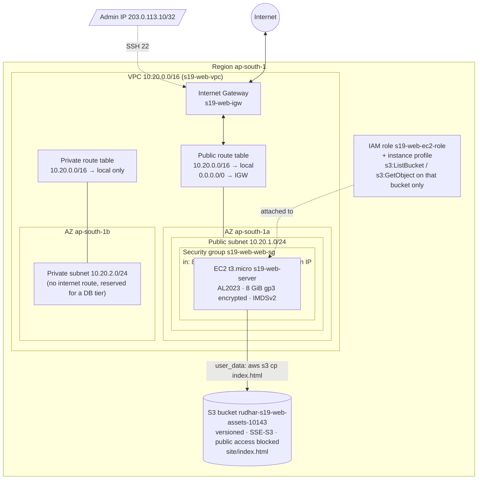

# Session 19: Cloud & Terraform in Action - Homework

**Name:** Rudhar Bajaj
**Environment:** macOS (Apple Silicon), Docker Desktop 29.6.1, Terraform 1.16.4, hashicorp/aws provider 6.67.0, AWS CLI 2.35.21, LocalStack community 4.14.0 (container `hw-localstack`, port 4566) standing in for AWS

Every output block below is real output from commands I ran on 2026-10-07. Full untrimmed transcripts
are in `outputs/`. Where I shortened a listing I say so.

## Transcripts

| File | What it shows |
|---|---|
| [`01-init-fmt-validate.txt`](outputs/01-init-fmt-validate.txt) | `terraform version`, `init`, `fmt`, `fmt -check`, `validate` |
| [`02-plan.txt`](outputs/02-plan.txt) | The full `plan -out=tfplan` (18 to add) |
| [`03-apply.txt`](outputs/03-apply.txt) | `apply tfplan`, creation order, outputs |
| [`04-output-and-state.txt`](outputs/04-output-and-state.txt) | `output`, `state list`, `state show` (VPC, instance, SG), dependencies stored in state, no-change plan |
| [`05-graph.txt`](outputs/05-graph.txt) + [`graph.dot`](outputs/graph.dot) | `terraform graph` (DOT) and the edges that matter |
| [`06-aws-cli-verify.txt`](outputs/06-aws-cli-verify.txt) | `aws ec2 describe-*`, `s3api`, `iam` against LocalStack. Proof that each resource exists |
| [`07-destroy.txt`](outputs/07-destroy.txt) | `plan -destroy`, `destroy` (18 destroyed), and checks that everything is gone |

## 1. Concepts (from 01-05, in my own words)

**Cloud service models.** The question is how much of the stack I still look after.

| Model | I manage | Provider manages | Example | My analogy |
|---|---|---|---|---|
| IaaS | OS, runtime, app, data, firewall rules on the VM | Hardware, hypervisor, physical network | EC2, EBS, VPC | Renting an empty flat |
| PaaS | My code and its config | OS, runtime, scaling, patching | Elastic Beanstalk, App Runner, RDS (database as a platform) | A furnished flat |
| SaaS | Just my data and settings | Everything | Gmail, Slack, Google Docs | A hotel room |

This project is pure IaaS: I define the network, the VM and its firewall myself.

**Regions and AZs.** A **region** (`ap-south-1` = Mumbai) is a separate geographic deployment of AWS. I pick it for latency to users, data-residency laws, and price/feature availability. An **Availability Zone** is one or more data centres inside a region, with their own power and networking, a few km from the others and joined by fast links. One region has several AZs (`ap-south-1a/b/c`). Some resources are regional (VPC, S3 bucket, IAM roles are even global) and some live in one AZ (subnet, EC2 instance, EBS volume). Spreading copies across AZs is the basic recipe for high availability. In this project the public subnet is in `ap-south-1a` and the private one in `ap-south-1b`.

**VPC / subnet / IGW / route table / SG.** The VPC is my private network (`10.20.0.0/16`), and subnets are slices of it (`/24` = 256 addresses, 251 usable on AWS). A subnet is "public" only because its route table sends `0.0.0.0/0` to the Internet Gateway. The route table answers *where does traffic go?*, and the security group answers *is this traffic allowed?* SGs are stateful, so replies are allowed automatically.

## 2. Architecture



ASCII fallback:

```text
                         Internet                      Admin 203.0.113.10/32
                             |                                  |
                             v                                  | SSH 22 only
                    +------------------+                        |
                    | Internet Gateway |<-----------------------+
                    |   s19-web-igw    |
                    +--------+---------+
                             |
+----------------------------|-------------- VPC 10.20.0.0/16 (ap-south-1) -----------------+
|                            |                                                              |
|   Public route table: 10.20.0.0/16 -> local, 0.0.0.0/0 -> IGW                              |
|                            |                                                              |
|  +-- AZ ap-south-1a -------v-------------+     +-- AZ ap-south-1b -------------------+    |
|  | Public subnet 10.20.1.0/24            |     | Private subnet 10.20.2.0/24          |    |
|  |  +-- SG s19-web-web-sg -------------+ |     |  (route table: local only,           |    |
|  |  | in : 80,443 from 0.0.0.0/0       | |     |   no internet; future DB tier)       |    |
|  |  |      22 from 203.0.113.10/32     | |     +-------------------------------------+    |
|  |  | out: all                          | |                                               |
|  |  |  [ EC2 t3.micro s19-web-server ]  | |                                               |
|  |  |  AL2023, 8 GiB gp3 (encrypted)    | |                                               |
|  |  +------------------|----------------+ |                                               |
|  +---------------------|------------------+                                               |
+------------------------|------------------------------------------------------------------+
                         | IAM role s19-web-ec2-role (instance profile):
                         | s3:ListBucket + s3:GetObject on this bucket only
                         v
              +-------------------------------------------+
              | S3 rudhar-s19-web-assets-10143            |
              | versioned, SSE-S3, public access blocked   |
              | site/index.html  (nginx page)              |
              +-------------------------------------------+
```

## 3. The Terraform project

I started from the instructor's `06-terraform-vpc` / `08-mini-project` (same VPC `10.20.0.0/16`, subnet, IGW, route table, web SG) and extended it. I added a private subnet + route table, SSH limited to one IP, an EC2 instance with an IAM role, and an S3 bucket with an object. The instructor's folders are untouched. I split the code by concern:

| File | Contents |
|---|---|
| `versions.tf` | `required_version >= 1.6.0`, `hashicorp/aws ~> 6.0` |
| `provider.tf` | AWS **provider**, LocalStack switch (`use_localstack`), `default_tags` (Project/Session/ManagedBy/Owner on everything) |
| `variables.tf` | 10 **variables** with types, descriptions, defaults. Two have `validation` blocks: `vpc_cidr` must be a CIDR, and `ssh_allowed_cidr` must not be `0.0.0.0/0` |
| `terraform.tfvars` | My values. No secrets, so committed (`homework/.gitignore` re-includes it; the session-level `.gitignore` ignores `*.tfvars`) |
| `network.tf` | `data.aws_availability_zones`, VPC, 2 subnets, IGW, 2 route tables + associations, security group |
| `storage.tf` | S3 bucket + versioning + encryption + public access block + `aws_s3_object` (index.html) |
| `compute.tf` | `data.aws_ami` (latest AL2023), IAM role/policy/instance profile from `aws_iam_policy_document` data sources, `aws_instance.web` with the explicit `depends_on` |
| `outputs.tf` | 12 **outputs**: IDs, CIDR, AZs, AMI, IPs, bucket, URL |
| `backend.tf.example` | Remote S3 backend + locking, commented (see section 6) |
| `.terraform.lock.hcl` | Provider lock, committed |

18 managed resources + 4 data sources. Each feature from the spec appears in the code:

| Spec item | Where |
|---|---|
| Providers | `provider "aws"` with a conditional `dynamic "endpoints"` block |
| Variables | `variables.tf` + `terraform.tfvars`, used as `var.vpc_cidr`, `var.instance_type`, ... |
| Resources | 18 `resource` blocks across 3 files |
| Outputs | `outputs.tf`, shown after apply and with `terraform output` |
| Implicit dependencies | Every `aws_vpc.main.id`, `aws_subnet.public.id`, `aws_s3_bucket.assets.arn` reference |
| Explicit dependency | `depends_on = [aws_route_table_association.public]` on the instance |
| State | `state list`, `state show`, the dependencies stored in state, remote backend example |

## 4. Dependencies: implicit vs explicit

**Implicit dependencies** come from references. `aws_subnet.public` contains `vpc_id = aws_vpc.main.id`, so Terraform knows the VPC has to exist first (its ID isn't known until then). I never wrote an order. The apply shows Terraform working it out and running independent things in parallel ([`03-apply.txt`](outputs/03-apply.txt)):

```text
aws_iam_role.web: Creating...
aws_vpc.main: Creating...
aws_s3_bucket.assets: Creating...                 <- three roots start together
aws_vpc.main: Creation complete after 0s [id=vpc-f1cc7a5f7a3f5f535]
aws_internet_gateway.main: Creating...            <- everything that needs vpc_id starts now
aws_route_table.private: Creating...
aws_subnet.private: Creating...
aws_subnet.public: Creating...
aws_security_group.web: Creating...
...
aws_subnet.public: Creation complete after 11s [id=subnet-186a11a16ef49091c]
aws_route_table_association.public: Creating...
aws_route_table_association.public: Creation complete after 1s [id=rtbassoc-d68f9e9418fec3ae5]
aws_instance.web: Creating...                     <- only after the association
aws_instance.web: Creation complete after 12s [id=i-64322a6970fd09dc1]

Apply complete! Resources: 18 added, 0 changed, 0 destroyed.
```

(trimmed; the `<-` notes are mine)

**The explicit `depends_on`** is in `compute.tf`:

```hcl
resource "aws_instance" "web" {
  subnet_id              = aws_subnet.public.id        # implicit
  vpc_security_group_ids = [aws_security_group.web.id] # implicit
  user_data = <<-EOF
    dnf install -y nginx
    aws s3 cp s3://${aws_s3_bucket.assets.bucket}/${aws_s3_object.index.key} ...
  EOF
  depends_on = [aws_route_table_association.public]     # explicit
}
```

(abridged)

Why it's needed: the instance references the subnet and the SG, but **nothing** about the route table or the IGW. Without `depends_on`, Terraform may launch the instance as soon as the subnet exists, possibly before the `0.0.0.0/0 → IGW` route is attached. On real AWS, `user_data` runs once at first boot and needs the internet for `dnf install nginx`. It would fail silently while Terraform reports success. That is a dependency on *behaviour*, which no attribute reference expresses. So I state it, and the apply log above shows the instance starting only after the association completed. `depends_on` is the exception: references are preferred because they also pass the value, and they don't make Terraform over-serialise.

The ordering is stored in state too ([`04-output-and-state.txt`](outputs/04-output-and-state.txt)). The instance's recorded dependencies include the route table association and, transitively, the IGW:

```text
aws_instance.web dependencies recorded in state:
   aws_iam_instance_profile.web
   aws_iam_role.web
   aws_internet_gateway.main
   aws_route_table.public
   aws_route_table_association.public
   aws_s3_bucket.assets
   aws_s3_object.index
   aws_security_group.web
   aws_subnet.public
   aws_vpc.main
   ...
```

Terraform uses this at destroy time, when the data is gone from the config, to delete in reverse order.

### `terraform graph`

```text
$ terraform graph > outputs/graph.dot; echo "exit code: $?"; wc -l outputs/graph.dot
exit code: 0
      52 outputs/graph.dot
$ grep -c -- '->' outputs/graph.dot
26
$ grep -E '"aws_instance.web" ->' outputs/graph.dot
  "aws_instance.web" -> "data.aws_ami.al2023";
  "aws_instance.web" -> "aws_iam_instance_profile.web";
  "aws_instance.web" -> "aws_route_table_association.public";
  "aws_instance.web" -> "aws_s3_object.index";
  "aws_instance.web" -> "aws_security_group.web";
```

`aws_instance.web -> aws_route_table_association.public` is the `depends_on` edge. The graph has no direct edge from the instance to `aws_subnet.public` or `aws_s3_bucket.assets`, even though the code references both. Terraform 1.16's graph output drops edges that are already implied by a longer path (instance → association → subnet, instance → object → bucket). The DOT file is in `outputs/graph.dot`. I don't have Graphviz installed, but `dot -Tsvg outputs/graph.dot > graph.svg` or any online DOT viewer renders it.

## 5. The workflow

### init / fmt / validate ([`01`](outputs/01-init-fmt-validate.txt))

```text
$ terraform init -no-color
- Finding hashicorp/aws versions matching "~> 6.0"...
- Installed hashicorp/aws v6.67.0 (signed by HashiCorp)
Terraform has created a lock file .terraform.lock.hcl ...
Terraform has been successfully initialized!

$ terraform fmt -recursive; echo "fmt exit code: $?"
compute.tf
fmt exit code: 0

$ terraform validate -no-color
Success! The configuration is valid.
```

`fmt` printed `compute.tf` because it re-aligned the inline comments after `subnet_id`/`vpc_security_group_ids` that I had written by hand. The second run (`fmt -check`) exited 0.

### plan ([`02`](outputs/02-plan.txt))

```text
$ terraform plan -no-color -out=tfplan
  # data.aws_iam_policy_document.read_assets will be read during apply
  # (config refers to values not yet known)
  # aws_iam_instance_profile.web will be created
  # aws_instance.web will be created
      + ami                                  = "ami-0ff5003538b60d5ec"
  # aws_subnet.private will be created
      + availability_zone                              = "ap-south-1b"
      + cidr_block                                     = "10.20.2.0/24"
  # aws_subnet.public will be created
      + availability_zone                              = "ap-south-1a"
      + cidr_block                                     = "10.20.1.0/24"
  # aws_vpc.main will be created
      + cidr_block                           = "10.20.0.0/16"
  ...
Plan: 18 to add, 0 to change, 0 to destroy.
```

(heavily trimmed; the full plan is 620 lines)

The data sources were already read at plan time. `data.aws_ami.al2023` resolved to `ami-0ff5003538b60d5ec` (Amazon Linux 2023, kernel 6.1, x86_64) and the AZ data source gave `ap-south-1a/b`. The policy document for the bucket is read *during apply*, because it needs the bucket ARN, which doesn't exist yet.

### apply

Shown in section 4. The outputs:

```text
ami_id = "ami-0ff5003538b60d5ec"
assets_bucket = "rudhar-s19-web-assets-10143"
availability_zones_used = [
  "ap-south-1a",
  "ap-south-1b",
]
instance_id = "i-64322a6970fd09dc1"
instance_private_ip = "10.20.1.4"
instance_public_ip = "54.214.196.113"
private_subnet_id = "subnet-6dbf0d351ad1e6bee"
public_subnet_id = "subnet-186a11a16ef49091c"
security_group_id = "sg-184ee2cd204ac1dcc"
vpc_cidr = "10.20.0.0/16"
vpc_id = "vpc-f1cc7a5f7a3f5f535"
web_url = "http://54.214.196.113/"
```

`10.20.1.4` is the first free address in the public subnet, because `.0`-`.3` are reserved by AWS.

## 6. Terraform state

```text
$ terraform state list
data.aws_ami.al2023
data.aws_availability_zones.available
data.aws_iam_policy_document.ec2_assume
data.aws_iam_policy_document.read_assets
aws_iam_instance_profile.web
aws_iam_role.web
aws_iam_role_policy.read_assets
aws_instance.web
aws_internet_gateway.main
aws_route_table.private
aws_route_table.public
aws_route_table_association.private
aws_route_table_association.public
aws_s3_bucket.assets
aws_s3_bucket_public_access_block.assets
aws_s3_bucket_server_side_encryption_configuration.assets
aws_s3_bucket_versioning.assets
aws_s3_object.index
aws_security_group.web
aws_subnet.private
aws_subnet.public
aws_vpc.main
```

22 entries: 18 managed resources + 4 data sources (data sources are cached in state, not "owned").

```text
$ terraform state show -no-color aws_instance.web
resource "aws_instance" "web" {
    ami                                  = "ami-0ff5003538b60d5ec"
    associate_public_ip_address          = true
    availability_zone                    = "ap-south-1a"
    iam_instance_profile                 = "s19-web-ec2-profile"
    id                                   = "i-64322a6970fd09dc1"
    instance_state                       = "running"
    instance_type                        = "t3.micro"
    private_ip                           = "10.20.1.4"
    public_ip                            = "54.214.196.113"
    subnet_id                            = "subnet-186a11a16ef49091c"
    vpc_security_group_ids               = [
        "sg-184ee2cd204ac1dcc",
    ]
    metadata_options {
        http_tokens                 = "required"
        ...
    root_block_device {
        encrypted             = true
        volume_id             = "vol-f934573165079bed7"
        volume_size           = 8
        volume_type           = "gp3"
        ...
```

(trimmed. `state show` for `aws_vpc.main` and `aws_security_group.web` are in the transcript)

State is the mapping from `aws_instance.web` to `i-64322a6970fd09dc1`, plus every attribute AWS returned. A `plan` right after apply refreshed all 18 and said `No changes. Your infrastructure matches the configuration.`

**Why local state isn't enough for a team, and what the remote backend fixes** (see [`backend.tf.example`](backend.tf.example)):

```hcl
terraform {
  backend "s3" {
    bucket       = "rudhar-tfstate-10143"
    key          = "session19/web/terraform.tfstate"
    region       = "ap-south-1"
    encrypt      = true
    use_lockfile = true          # Terraform >= 1.10: S3-native lock (.tflock object)
    # dynamodb_table = "terraform-locks"   # older way, now deprecated
  }
}
```

| Problem with local `terraform.tfstate` | Remote S3 backend |
|---|---|
| Lives on one laptop. Teammates and CI can't see it, so they'd try to re-create everything | One shared copy, read by everyone through `init` |
| Two `apply`s at once can corrupt it | **Locking**: the second run waits or fails with "Error acquiring the state lock". Done with a `.tflock` object (`use_lockfile`) or, in the older style, a DynamoDB table whose partition key is `LockID` |
| Deleted file = Terraform forgets what it owns | Bucket **versioning** keeps every past state |
| Contains every attribute in plain text | `encrypt = true` + bucket policy/IAM limiting who can read it |

Moving to it is `terraform init -migrate-state`. I kept local state for the homework (gitignored) so the project works with nothing pre-created.

## 7. Proof the resources exist (aws CLI against LocalStack)

[`06-aws-cli-verify.txt`](outputs/06-aws-cli-verify.txt). These replace console screenshots.

```text
$ aws --endpoint-url http://localhost:4566 ec2 describe-vpcs --filters Name=tag:Name,Values=s19-web-vpc ... --output table
|  10.20.0.0/16 |  available |  vpc-f1cc7a5f7a3f5f535  |

$ aws ... ec2 describe-subnets --filters Name=tag:Project,Values=s19-web ... --output table
|  ap-south-1a|  10.20.1.0/24 |  s19-web-public-subnet  |  True   |  subnet-186a11a16ef49091c   |
|  ap-south-1b|  10.20.2.0/24 |  s19-web-private-subnet |  False  |  subnet-6dbf0d351ad1e6bee   |

$ aws ... ec2 describe-route-tables --filters Name=tag:Project,Values=s19-web ... --output table
|  s19-web-private-rt|  10.20.0.0/16-> local                                     |  subnet-6dbf0d351ad1e6bee  |
|  s19-web-public-rt |  10.20.0.0/16-> local, 0.0.0.0/0-> igw-1a63abbeeb160ece9  |  subnet-186a11a16ef49091c  |

$ aws ... ec2 describe-security-groups --filters Name=group-name,Values=s19-web-web-sg ... --output table
|  HTTPS                      |  0.0.0.0/0        |  443  |  tcp   |
|  SSH from the admin IP only |  203.0.113.10/32  |  22   |  tcp   |
|  HTTP                       |  0.0.0.0/0        |  80   |  tcp   |

$ aws ... ec2 describe-instances --filters Name=tag:Name,Values=s19-web-server ...
{ "Id": "i-64322a6970fd09dc1", "State": "running", "Type": "t3.micro", "AMI": "ami-0ff5003538b60d5ec",
  "Subnet": "subnet-186a11a16ef49091c", "PrivateIp": "10.20.1.4", "PublicIp": "54.214.196.113",
  "SG": "s19-web-web-sg", "Profile": "arn:aws:iam::000000000000:instance-profile/s19-web-ec2-profile" }

$ aws ... s3 cp s3://rudhar-s19-web-assets-10143/site/index.html -
<!doctype html>
<title>s19-web</title>
<h1>Session 19: deployed by Terraform</h1>
<p>VPC 10.20.0.0/16, public subnet 10.20.1.0/24, region ap-south-1.</p>

$ aws ... iam get-role-policy --role-name s19-web-ec2-role --policy-name read-assets ...
"Sid": "ListAssetsBucket", "Action": "s3:ListBucket", "Resource": "arn:aws:s3:::rudhar-s19-web-assets-10143"
"Sid": "ReadAssets",       "Action": "s3:GetObject",  "Resource": "arn:aws:s3:::rudhar-s19-web-assets-10143/*"
```

(table borders and headers trimmed, JSON compressed)

The transcript also has the IGW attachment, the user data read back from the instance, the encrypted 8 GiB gp3 root volume, and the bucket's versioning and public access block.

**Honest note on EC2 in LocalStack.** The instance is an API record. LocalStack community tracks its state, IPs, volume and user data, but **no VM boots**, so the user data never runs and nginx never serves the page:

```text
$ curl -s -m 5 -o /dev/null -w '%{http_code}\n' http://$(terraform output -raw instance_public_ip)/; echo "curl exit code: $?"
000
curl exit code: 28
$ docker ps --format '{{.Names}}  {{.Image}}' | grep -i -E 'localstack|ec2'
hw-localstack  localstack/localstack:4.14.0
```

`54.214.196.113` is an address LocalStack made up. Nothing answered (curl timeout, exit 28), and the only container running is LocalStack itself. On real AWS, with `use_localstack = false`, the same code would boot Amazon Linux, install nginx, copy `index.html` from S3 using the instance role, and serve it on `web_url`.

## 8. Destroy ([`07`](outputs/07-destroy.txt))

```text
$ terraform plan -destroy -no-color | grep -E "^  # |^Plan:"
  # aws_iam_instance_profile.web will be destroyed
  ...
  # aws_vpc.main will be destroyed
Plan: 0 to add, 0 to change, 18 to destroy.

$ terraform destroy -auto-approve -no-color
...
aws_instance.web: Destruction complete after 10s
aws_route_table_association.public: Destroying... [id=rtbassoc-d68f9e9418fec3ae5]
...
aws_internet_gateway.main: Destruction complete after 0s
aws_vpc.main: Destroying... [id=vpc-f1cc7a5f7a3f5f535]
aws_vpc.main: Destruction complete after 1s

Destroy complete! Resources: 18 destroyed.

$ aws ... ec2 describe-vpcs --filters Name=tag:Project,Values=s19-web --query 'length(Vpcs)'
0
$ aws ... s3api head-bucket --bucket rudhar-s19-web-assets-10143; echo "head-bucket exit code: $?"
aws: [ERROR]: An error occurred (404) when calling the HeadBucket operation: Not Found
head-bucket exit code: 254
$ aws ... iam get-role --role-name s19-web-ec2-role; echo "get-role exit code: $?"
aws: [ERROR]: An error occurred (NoSuchEntity) when calling the GetRole operation: Role s19-web-ec2-role not found
```

Destroy is the apply graph reversed. The instance went first, and only after it was gone did the route table association get removed (the reverse of the `depends_on`). The VPC was last, once everything inside it was gone. The terminated instance still shows in `describe-instances` as `terminated`, the same as on real AWS, where terminated instances stay visible for about an hour.

## Run it yourself

```bash
docker run -d --name hw-localstack -p 127.0.0.1:4566:4566 localstack/localstack:4.14.0
cd session19-cloud-terraform/homework
terraform init && terraform fmt && terraform validate
terraform plan -out=tfplan && terraform apply tfplan
terraform output && terraform state list && terraform graph > graph.dot
export AWS_ACCESS_KEY_ID=test AWS_SECRET_ACCESS_KEY=test AWS_DEFAULT_REGION=ap-south-1
aws --endpoint-url http://localhost:4566 ec2 describe-instances --filters Name=tag:Name,Values=s19-web-server
terraform destroy
docker rm -f hw-localstack
```

## Differences from the spec / honest notes

- **LocalStack instead of a real AWS account** (my choice, no cost). The provider config has the `use_localstack` switch, and `use_localstack = false` with real credentials is all it takes to deploy to AWS. I haven't run it against real AWS, so the boot-time behaviour (nginx actually serving) is unverified.
- **EC2 is emulated** (see section 7). VPC/subnet/route/SG/S3/IAM API objects were all created and read back. LocalStack community doesn't enforce IAM policies.
- **No NAT gateway in the Terraform project.** The private subnet has no internet route at all. A NAT GW costs money on real AWS, and nothing lives in that subnet yet. I did build a NAT GW by hand in the session 18 VPC lab.
- **No key pair on the instance.** SSH is allowed only from the placeholder `203.0.113.10/32`, and a real setup would add `key_name` or, better, use SSM Session Manager.
- **Remote state** is documented and given as `backend.tf.example`, but not activated.
- I used `plan -out` + `apply tfplan` and `destroy -auto-approve` so the transcripts don't block on the `yes` prompt.
